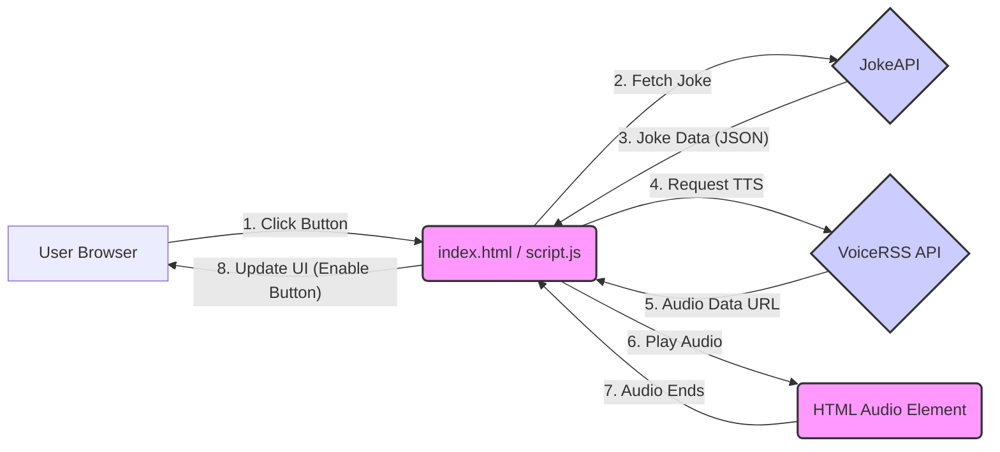

# System Architecture

This document outlines the architecture, components, data flow, and design decisions for the Awesome Kartikey Joke Teller project.

## Overview

The Awesome Kartikey Joke Teller is a purely **client-side web application**. It runs entirely within the user's web browser using standard web technologies (HTML, CSS, JavaScript). There is no backend component specific to this application; it relies on external, third-party APIs for its core functionality.

## System Architecture Diagram



**Legend:**

- Rectangles: Components within the application or browser.
- Diamonds: External API Services.

## Folder Structure

The project has a flat structure, typical for small front-end projects:

```
joke-teller/
├── index.html       # Main HTML file (Structure and entry point)
├── script.js        # Core JavaScript logic (API calls, DOM manipulation, event handling)
├── style.css        # CSS rules for styling the application
└── voice.js         # VoiceRSS JavaScript SDK (Handles TTS API communication)
(├── robot.gif)      # Optional: Background animation file referenced in CSS
```

## Major Components

1.  **User Interface (UI) (`index.html`, `style.css`)**

    - Provides the visual structure (`index.html`) with a button (`#jokeBtn`) and a hidden audio player (`#audio`).
    - Defines the appearance and layout (`style.css`), including the background GIF, button styling, and responsiveness using media queries.

2.  **Joke Fetching Logic (`script.js`)**

    - Contains the `getJoke` async function.
    - Uses the `fetch` API to make HTTP GET requests to the JokeAPI endpoint (`jokeApiUrl`).
    - Parses the JSON response from JokeAPI.
    - Handles both single-part (`data.joke`) and two-part (`data.setup`, `data.delivery`) joke formats.

3.  **Text-to-Speech (TTS) Integration (`script.js`, `voice.js`)**

    - `voice.js` is the provided VoiceRSS Javascript SDK. It encapsulates the logic for making POST requests to the VoiceRSS API.
    - `script.js` calls the `VoiceRSS.speech()` method from `voice.js`, passing the joke text, API key, language, voice, and other parameters.
    - `voice.js` receives the audio data (typically as a Base64 encoded data URI) from the VoiceRSS API.
    - It sets the `src` attribute of the `#audio` HTML element to this data URI and calls `.play()` to start playback.

4.  **State Management (`script.js`)**
    - Manages the enabled/disabled state of the `#jokeBtn`.
    - The `toggleButton` function flips the `disabled` property of the button.
    - The button is disabled (`toggleButton()`) just before the joke fetching (`getJoke`) begins.
    - An event listener on the `#audio` element triggers `toggleButton()` when the `ended` event fires, re-enabling the button after the joke finishes playing.

## Data Flow

1.  **User Interaction:** The user loads `index.html` and clicks the "Get Another Joke" button (`#jokeBtn`).
2.  **Event Trigger:** The click event listener in `script.js` calls the `getJoke()` function.
3.  **Button Disable:** `getJoke()` immediately calls `toggleButton()` to disable the button.
4.  **Joke API Request:** `getJoke()` sends an asynchronous `fetch` request to the JokeAPI URL.
5.  **Joke API Response:** JokeAPI processes the request and returns a JSON payload containing the joke (either as `joke` or `setup`/`delivery`).
6.  **Joke Processing:** `script.js` receives the response, checks the joke type (`single` or `twopart`), and constructs the final `joke` string.
7.  **TTS API Request:** `script.js` calls `tellJoke()`, which in turn calls `VoiceRSS.speech()` (defined in `voice.js`). It passes the joke string and configuration (API key, language, voice, format).
8.  **VoiceRSS SDK Action:** `voice.js` constructs and sends a POST request to the VoiceRSS API endpoint (`https://api.voicerss.org/`).
9.  **TTS API Response:** The VoiceRSS API generates the audio and sends back a response containing the audio data (as a Base64 data URI because `b64=true` is specified).
10. **Audio Playback:** `voice.js`, within its XHR `onreadystatechange` handler, checks for a successful response, sets the `src` attribute of the `#audio` element to the received data URI, and calls `audioElement.play()`.
11. **Audio Completion:** The browser plays the audio. When playback finishes, the `ended` event is fired on the `#audio` element.
12. **Button Re-enable:** The `ended` event listener in `script.js` calls `toggleButton()` to re-enable the button, allowing the user to request another joke.
13. **Error Handling (Basic):** A `try...catch` block in `getJoke()` logs errors during the fetch process to the console. `voice.js` throws errors for invalid settings or API responses starting with "ERROR".

## Design Decisions

1.  **Client-Side Architecture:** Chosen for simplicity and ease of deployment (no backend needed). Suitable for a small demonstration project.
2.  **External APIs:** Leveraging JokeAPI and VoiceRSS avoids the need to maintain joke databases or implement complex TTS engines.
3.  **VoiceRSS SDK:** Using the provided `voice.js` simplifies interaction with the VoiceRSS API, although it uses older XHR methods instead of `fetch`.
4.  **API Key Exposure:** The VoiceRSS API key is embedded directly in `script.js`. This was done for simplicity in this demo project but is **not a secure practice** for production (See Q3 in FAQ.md). A backend proxy would be the standard solution.
5.  **Asynchronous Operations:** `async/await` is used with `fetch` in `getJoke()` for cleaner handling of the asynchronous API call to JokeAPI.
6.  **UI Feedback:** Disabling the button during operation provides clear feedback to the user that the application is processing their request.
7.  **Error Handling:** Basic console logging is implemented for fetch errors. More robust user-facing error handling could be added.
